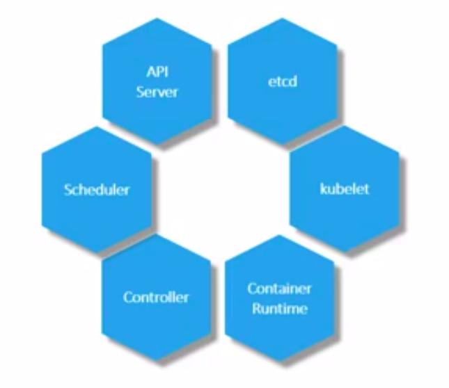
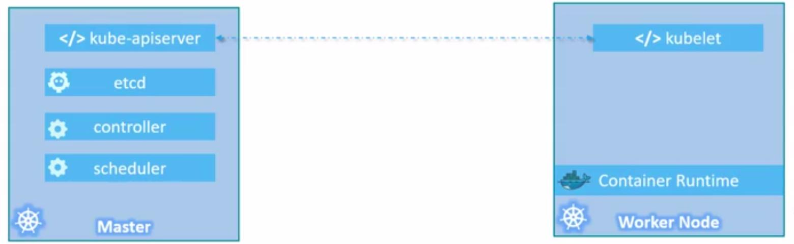

# k8s-notes
 - **Nodes(Minions)** - is a machine (physical or virtual) on which k8s is installed. Also, it's a worker machine wherein k8s container will launch/reside.
 - **Cluster** is a set of nodes that group and connect together.
 - **Master** - is another node on which k8 is installed and configured as a master. The master is responsible for the actual orchestration of containers on the worker nodes.Components
 
 ### K8S Components
 Once you've installed K8s on your system, you're actually installed the following components.
 
 "K8S Components")
  
  - **API Server** acts as a frontend for K8S, such as User Management Devices, command-line interfaces are all talked to API server to interact with the K8S cluster. 
  - **etcd** is a distributed key-value store being use by k8s to store all data use to manage the cluster.
  - **Scheduler** is responsible for distributing work or containers across multiple nodes. It looks for newly created containers and assigned to nodes.
  - **Controllers** (BRAIN behind orchestration) is responsible for noticing/responding when nodes container's endpoint goes down. It also makes decision to bring up new containers in such case.
  - **Container Runtime** is the underlying software that is used to run container. ex docker, rkt, etc.
  - **kubelet** is the agent run on each node in the cluster. It's responsible for making sure that the containers are running in the nodes as expected.
  
  
  
### Tools 
 - **kubectl**  is the Kubernetes `command-line tool` that allows you to run commands against `Kubernetes clusters`. You can use kubectl to `deploy applications`, `inspect`, `manage cluster resource`s, and `view logs`.
   Common commands:
    - kubectl version --client
    - kubectl cluster-info
    - kubectl get nodes   // to view the OS-IMAGE column, add `-o wide`
    - kubectl create deployment
    - kubectl expose deployment
    - kubectl get pod
    - kubectl delete services <service-name>
    - kubectl delete deployment <deployment-name>
  
 - **Minikube** is a `tool` that makes it easy to run Kubernetes locally. Minikube runs a **single-node Kubernetes cluster** inside a Virtual Machine (VM), docker, etc. on your laptop for users looking to try out Kubernetes or develop with it day-to-day.
 
 

  Common commands:
   - minikube service <service-name> --url - Get the URL of the exposed `service`, to view the `service` details, remove --url.
   - minukube start - start minikube and create cluster.
   - minikube stop - Stop the local Minikube cluster.
   - minikube delete - Delete the local Minikube cluster.
