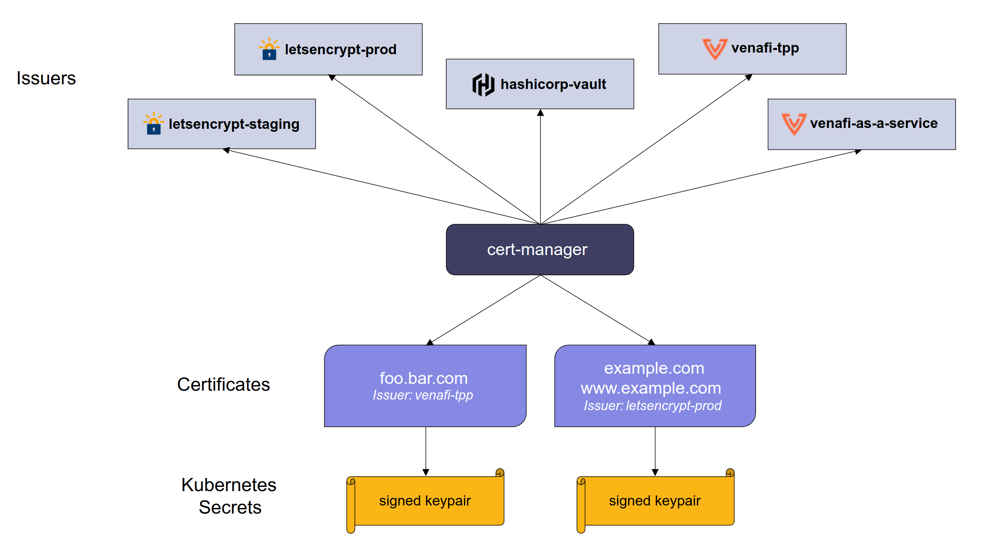

Deploy AWS Load Balancer controller
---
Let’s deploy the AWS ALB Ingress controller into our EKS cluster using the steps below.

#### Prerequisite
*Note: Make sure that you've IAM OIDC provider associated with cluster. If not, kindly refer to [cluster.md](../cluster.md) at **Step 2: Creating an IAM OIDC provider for your cluster.***


### Create Service Account with IAM Role & Permissions for the AWS Load Balancer Controller
 - Create an IAM policy named `AWSLoadBalancerControllerIAMPolicy` to allow the ALB Ingress controller to make AWS API calls on your behalf
    ```bash
    aws iam create-policy \
    --policy-name AWSLoadBalancerControllerIAMPolicy \
    --policy-document https://raw.githubusercontent.com/kubernetes-sigs/aws-load-balancer-controller/main/docs/install/iam_policy.json

    # If you want specific version: https://raw.githubusercontent.com/kubernetes-sigs/aws-load-balancer-controller/v2.3.1/docs/install/iam_policy.json
    ```
    ```json
    // Output
    {
        "Policy": {
            "PolicyName": "AWSLoadBalancerControllerIAMPolicy", 
            "PermissionsBoundaryUsageCount": 0, 
            "CreateDate": "2023-01-13T07:40:01Z", 
            "AttachmentCount": 0, 
            "IsAttachable": true, 
            "PolicyId": "ANPAXE26SPP7QVXKG6HOK", 
            "DefaultVersionId": "v1", 
            "Path": "/", 
            "Arn": "arn:aws:iam::491435228159:policy/AWSLoadBalancerControllerIAMPolicy", 
            "UpdateDate": "2023-01-13T07:40:01Z"
        }
    }
    ```
    Record the `Policy.Arn` in the command output, you will need it in the next step 

 - Create a `Kubernetes service account` and an `IAM role` (for the pod running the AWS ALB Ingress controller) by substituting `$PolicyARN` with the recorded value from the previous step:
    ```bash
   eksctl create iamserviceaccount \
       --cluster=app-cluster \
       --namespace=kube-system \
       --name=aws-load-balancer-controller \
       --role-name=AWSLoadBalancerControllerIAMRole \
       --attach-policy-arn=arn:aws:iam::491435228159:policy/AWSLoadBalancerControllerIAMPolicy \
       --override-existing-serviceaccounts \
       --approve \
       --tags "Project=Cap Build,Topic=EKS"
    ```
    ```bash
    # Output
    2023-01-19 17:55:14 [ℹ]  1 iamserviceaccount (kube-system/aws-load-balancer-controller) was included (based on the include/exclude rules)
    2023-01-19 17:55:14 [!]  metadata of serviceaccounts that exist in Kubernetes will be updated, as --override-existing-serviceaccounts was set
    2023-01-19 17:55:14 [ℹ]  1 task: { 
        2 sequential sub-tasks: { 
            create IAM role for serviceaccount "kube-system/aws-load-balancer-controller",
            create serviceaccount "kube-system/aws-load-balancer-controller",
        } }2023-01-19 17:55:14 [ℹ]  building iamserviceaccount stack "eksctl-app-cluster-addon-iamserviceaccount-kube-system-aws-load-balancer-controller"
    2023-01-19 17:55:14 [ℹ]  deploying stack "eksctl-app-cluster-addon-iamserviceaccount-kube-system-aws-load-balancer-controller"
    2023-01-19 17:55:14 [ℹ]  waiting for CloudFormation stack "eksctl-app-cluster-addon-iamserviceaccount-kube-system-aws-load-balancer-controller"
    2023-01-19 17:55:45 [ℹ]  waiting for CloudFormation stack "eksctl-app-cluster-addon-iamserviceaccount-kube-system-aws-load-balancer-controller"
    2023-01-19 17:56:42 [ℹ]  waiting for CloudFormation stack "eksctl-app-cluster-addon-iamserviceaccount-kube-system-aws-load-balancer-controller"
    2023-01-19 17:56:43 [ℹ]  created serviceaccount "kube-system/aws-load-balancer-controller"
    ```

    Verify k8s Service Account using kubectl.
    ```bash
    kubectl describe sa aws-load-balancer-controller -n kube-system 
    ```
    ```bash
    # Output
    Name:                aws-load-balancer-controller
    Namespace:           kube-system
    Labels:              app.kubernetes.io/managed-by=eksctl
    Annotations:         eks.amazonaws.com/role-arn: arn:aws:iam::491435228159:role/AWSLoadBalancerControllerIAMRole
    Image pull secrets:  <none>
    Mountable secrets:   <none>
    Tokens:              <none>
    Events:              <none>
    ```

### Deploy the AWS Load Balancer Controller
 - Install cert-manager so that you can inject the certificate configuration into the webhooks.
   > [cert-manager](https://github.com/cert-manager/cert-manager) adds certificates and certificate issuers as resource types in Kubernetes clusters, and simplifies the process of obtaining, renewing and using those certificates.

    
   ```bash
   # Template
   kubectl apply --validate=false -f https://github.com/jetstack/cert-manager/releases/download/$VERSION/cert-manager.yaml
   ```
   For the `$VERSION`, you can refer to this [link](https://github.com/cert-manager/cert-manager/releases) for the available version. For this tutorial, we'll use `v1.11.0`.
   ```bash
   kubectl apply --validate=false -f https://github.com/jetstack/cert-manager/releases/download/v1.11.0/cert-manager.yaml
   ```
   ```bash
   # Output
    namespace/cert-manager created
    customresourcedefinition.apiextensions.k8s.io/clusterissuers.cert-manager.io created
    customresourcedefinition.apiextensions.k8s.io/challenges.acme.cert-manager.io created
    customresourcedefinition.apiextensions.k8s.io/certificaterequests.cert-manager.io created
    customresourcedefinition.apiextensions.k8s.io/issuers.cert-manager.io created
    customresourcedefinition.apiextensions.k8s.io/certificates.cert-manager.io created
    customresourcedefinition.apiextensions.k8s.io/orders.acme.cert-manager.io created
    serviceaccount/cert-manager-cainjector created
    serviceaccount/cert-manager created
    serviceaccount/cert-manager-webhook created
    configmap/cert-manager-webhook created
    clusterrole.rbac.authorization.k8s.io/cert-manager-cainjector created
    clusterrole.rbac.authorization.k8s.io/cert-manager-controller-issuers created
    clusterrole.rbac.authorization.k8s.io/cert-manager-controller-clusterissuers created
    clusterrole.rbac.authorization.k8s.io/cert-manager-controller-certificates created
    clusterrole.rbac.authorization.k8s.io/cert-manager-controller-orders created
    clusterrole.rbac.authorization.k8s.io/cert-manager-controller-challenges created
    clusterrole.rbac.authorization.k8s.io/cert-manager-controller-ingress-shim created
    clusterrole.rbac.authorization.k8s.io/cert-manager-view created
    clusterrole.rbac.authorization.k8s.io/cert-manager-edit created
    clusterrole.rbac.authorization.k8s.io/cert-manager-controller-approve:cert-manager-io created
    clusterrole.rbac.authorization.k8s.io/cert-manager-controller-certificatesigningrequests created
    clusterrole.rbac.authorization.k8s.io/cert-manager-webhook:subjectaccessreviews created
    clusterrolebinding.rbac.authorization.k8s.io/cert-manager-cainjector created
    clusterrolebinding.rbac.authorization.k8s.io/cert-manager-controller-issuers created
    clusterrolebinding.rbac.authorization.k8s.io/cert-manager-controller-clusterissuers created
    clusterrolebinding.rbac.authorization.k8s.io/cert-manager-controller-certificates created
    clusterrolebinding.rbac.authorization.k8s.io/cert-manager-controller-orders created
    clusterrolebinding.rbac.authorization.k8s.io/cert-manager-controller-challenges created
    clusterrolebinding.rbac.authorization.k8s.io/cert-manager-controller-ingress-shim created
    clusterrolebinding.rbac.authorization.k8s.io/cert-manager-controller-approve:cert-manager-io created
    clusterrolebinding.rbac.authorization.k8s.io/cert-manager-controller-certificatesigningrequests created
    clusterrolebinding.rbac.authorization.k8s.io/cert-manager-webhook:subjectaccessreviews created
    role.rbac.authorization.k8s.io/cert-manager-cainjector:leaderelection created
    role.rbac.authorization.k8s.io/cert-manager:leaderelection created
    role.rbac.authorization.k8s.io/cert-manager-webhook:dynamic-serving created
    rolebinding.rbac.authorization.k8s.io/cert-manager-cainjector:leaderelection created
    rolebinding.rbac.authorization.k8s.io/cert-manager:leaderelection created
    rolebinding.rbac.authorization.k8s.io/cert-manager-webhook:dynamic-serving created
    service/cert-manager created
    service/cert-manager-webhook created
    deployment.apps/cert-manager-cainjector created
    deployment.apps/cert-manager created
    deployment.apps/cert-manager-webhook created
    mutatingwebhookconfiguration.admissionregistration.k8s.io/cert-manager-webhook created
    validatingwebhookconfiguration.admissionregistration.k8s.io/cert-manager-webhook created
   ```

 -  Download the manifest file for the AWS Load Balancer Controller from AWS GitHub, run the following command:
    ```bash
    # Template
    curl -Lo ingress-controller.yaml https://github.com/kubernetes-sigs/aws-load-balancer-controller/releases/download/$VERSION/v2_4_1_full.yaml
    ```
    For this tutorial, we'll use `v2.4.6` version. Change the `$VERSION` and `v2_4_1`_full.yaml based on version. 
     ```bash
    # Will download the content and save it to `ingress-controller.yaml`
    curl -Lo ingress-controller.yaml https://github.com/kubernetes-sigs/aws-load-balancer-controller/releases/download/v2.4.6/v2_4_6_full.yaml
    ```
 - Update the following `ingress-controller.yaml` information.
    - Edit the cluster-name for your cluster. Search for `your-cluster-name` and replace it with the name of cluster.
      ```yaml
      spec:
        containers:
        - args:
            - --cluster-name=app-cluster       # from your-cluster-name to app-cluster
            - --ingress-class=alb
            image: public.ecr.aws/eks/aws-load-balancer-controller:v2.4.6
      ```
    - Update only the `ServiceAccount` section of the file only.
      ```yaml
        apiVersion: v1
        kind: ServiceAccount
        metadata:
        labels:
            app.kubernetes.io/component: controller
            app.kubernetes.io/name: aws-load-balancer-controller
         # Add the annotations line,
         # so it won't override the created IAM role in the 1st step.    
        annotations:       
            eks.amazonaws.com/role-arn: arn:aws:iam::491435228159:role/AWSLoadBalancerControllerIAMRole             
        name: aws-load-balancer-controller
        namespace: kube-system
      ```
 - Deploy AWS Load Balancer Controller
   ```bash
   kubectl apply -f ingress-controller.yaml
   ```
   ```bash
   # Output
    customresourcedefinition.apiextensions.k8s.io/ingressclassparams.elbv2.k8s.aws created
    customresourcedefinition.apiextensions.k8s.io/targetgroupbindings.elbv2.k8s.aws created
    Warning: resource serviceaccounts/aws-load-balancer-controller is missing the kubectl.kubernetes.io/last-applied-configuration annotation which is required by kubectl apply. kubectl apply should only be used on resources created declaratively by either kubectl create --save-config or kubectl apply. The missing annotation will be patched automatically.
    serviceaccount/aws-load-balancer-controller configured
    role.rbac.authorization.k8s.io/aws-load-balancer-controller-leader-election-role created
    clusterrole.rbac.authorization.k8s.io/aws-load-balancer-controller-role created
    rolebinding.rbac.authorization.k8s.io/aws-load-balancer-controller-leader-election-rolebinding created
    clusterrolebinding.rbac.authorization.k8s.io/aws-load-balancer-controller-rolebinding created
    service/aws-load-balancer-webhook-service created
    deployment.apps/aws-load-balancer-controller created
    certificate.cert-manager.io/aws-load-balancer-serving-cert created
    issuer.cert-manager.io/aws-load-balancer-selfsigned-issuer created
    mutatingwebhookconfiguration.admissionregistration.k8s.io/aws-load-balancer-webhook created
    validatingwebhookconfiguration.admissionregistration.k8s.io/aws-load-balancer-webhook created
    ingressclass.networking.k8s.io/alb created
   ```

 -  Verify that the aws load controller is installed:
    ```bash
    kubectl -n kube-system describe deployment aws-load-balancer-controller
    ```
    ```bash
    # Output
    Name:                   aws-load-balancer-controller
    Namespace:              kube-system
    CreationTimestamp:      Thu, 19 Jan 2023 18:34:28 +0800
    Labels:                 app.kubernetes.io/component=controller
                            app.kubernetes.io/name=aws-load-balancer-controller
    Annotations:            deployment.kubernetes.io/revision: 1
    Selector:               app.kubernetes.io/component=controller,app.kubernetes.io/name=aws-load-balancer-controller
    Replicas:               1 desired | 1 updated | 1 total | 1 available | 0 unavailable
    StrategyType:           RollingUpdate
    MinReadySeconds:        0
    RollingUpdateStrategy:  25% max unavailable, 25% max surge
    Pod Template:
    Labels:           app.kubernetes.io/component=controller
                        app.kubernetes.io/name=aws-load-balancer-controller
    Service Account:  aws-load-balancer-controller
    Containers:
    controller:
        Image:      public.ecr.aws/eks/aws-load-balancer-controller:v2.4.6
        Port:       9443/TCP
        Host Port:  0/TCP
        Args:
        --cluster-name=your-cluster-name
        --ingress-class=alb
        Limits:
        cpu:     200m
        memory:  500Mi
        Requests:
        cpu:        100m
        memory:     200Mi
        Liveness:     http-get http://:61779/healthz delay=30s timeout=10s period=10s #success=1 #failure=2
        Environment:  <none>
        Mounts:
        /tmp/k8s-webhook-server/serving-certs from cert (ro)
    Volumes:
    cert:
        Type:               Secret (a volume populated by a Secret)
        SecretName:         aws-load-balancer-webhook-tls
        Optional:           false
    Priority Class Name:  system-cluster-critical
    Conditions:
    Type           Status  Reason
    ----           ------  ------
    Available      True    MinimumReplicasAvailable
    Progressing    True    NewReplicaSetAvailable
    OldReplicaSets:  <none>
    NewReplicaSet:   aws-load-balancer-controller-7858ff68b9 (1/1 replicas created)
    Events:
    Type    Reason             Age    From                   Message
    ----    ------             ----   ----                   -------
    Normal  ScalingReplicaSet  3m32s  deployment-controller  Scaled up replica set aws-load-balancer-controller-7858ff68b9 to 1

    ```
 - Verify AWS Load Balancer Controller Webhook service created
    ```bash
    kubectl -n kube-system get svc aws-load-balancer-webhook-service
    ```
    ```bash
    # Output
    NAME                                TYPE        CLUSTER-IP      EXTERNAL-IP   PORT(S)   AGE
    aws-load-balancer-webhook-service   ClusterIP   10.100.38.250   <none>        443/TCP   3m27s
    ```

 - Verify AWS Load Balancer Controller Logs
    ```bash
    # List Pods
    kubectl get pods -n kube-system | grep aws-load-balancer-controller

    # Output
    aws-load-balancer-controller-7858ff68b9-njdw5   1/1     Running   0          5m27s
    ``` 

    ```bash
     kubectl -n kube-system logs -f aws-load-balancer-controller-7858ff68b9-njdw5
    ```
    ```bash
    # Output
    {"level":"info","ts":1673596695.9520242,"msg":"version","GitVersion":"v2.4.6","GitCommit":"a92e689dfe464f5b24784f398947e0fef31dc470","BuildDate":"2023-01-12T06:29:16+0000"}
    {"level":"info","ts":1673596695.9800384,"logger":"controller-runtime.metrics","msg":"metrics server is starting to listen","addr":":8080"}
    {"level":"info","ts":1673596695.984325,"logger":"setup","msg":"adding health check for controller"}
    {"level":"info","ts":1673596695.9844737,"logger":"controller-runtime.webhook","msg":"registering webhook","path":"/mutate-v1-pod"}
    {"level":"info","ts":1673596695.9845953,"logger":"controller-runtime.webhook","msg":"registering webhook","path":"/mutate-elbv2-k8s-aws-v1beta1-targetgroupbinding"}
    {"level":"info","ts":1673596695.9847312,"logger":"controller-runtime.webhook","msg":"registering webhook","path":"/validate-elbv2-k8s-aws-v1beta1-targetgroupbinding"}
    {"level":"info","ts":1673596695.9850075,"logger":"controller-runtime.webhook","msg":"registering webhook","path":"/validate-networking-v1-ingress"}
    {"level":"info","ts":1673596695.9851177,"logger":"setup","msg":"starting podInfo repo"}
    I0113 07:58:17.985462       1 leaderelection.go:243] attempting to acquire leader lease kube-system/aws-load-balancer-controller-leader...
    {"level":"info","ts":1673596697.9858274,"msg":"starting metrics server","path":"/metrics"}
    {"level":"info","ts":1673596697.9858983,"logger":"controller-runtime.webhook.webhooks","msg":"starting webhook server"}
    {"level":"info","ts":1673596697.9862094,"logger":"controller-runtime.certwatcher","msg":"Updated current TLS certificate"}
    {"level":"info","ts":1673596697.9862907,"logger":"controller-runtime.webhook","msg":"serving webhook server","host":"","port":9443}
    {"level":"info","ts":1673596697.986575,"logger":"controller-runtime.certwatcher","msg":"Starting certificate watcher"}
    ```

### Deploy a sample application to test the AWS Load Balancer Controller
Deploy a sample application to verify that the AWS Load Balancer Controller creates a public Application Load Balancer because of the Ingress object.

 - To deploy a game called 2048 as a sample application, run the following command:
   ```bash
   kubectl apply -f https://raw.githubusercontent.com/kubernetes-sigs/aws-load-balancer-controller/$VERSION/docs/examples/2048/2048_full.yaml
   ```
   Note: Replace `$VERSION` with the version (from the Kubernetes SIGs GitHub site for example `v2.4.6`) of the AWS Load Balancer Controller that you want to deploy.
   ```bash
    kubectl apply -f https://raw.githubusercontent.com/kubernetes-sigs/aws-load-balancer-controller/v2.4.6/docs/examples/2048/2048_full.yaml
   ```
   ```bash
   # Output
    namespace/game-2048 created
    deployment.apps/deployment-2048 created
    service/service-2048 created
    ingress.networking.k8s.io/ingress-2048 created
   ```
- To verify that the Ingress resource was created, wait a few minutes, and then run the following command: 
    ```bash
    kubectl get ingress/ingress-2048 -n game-2048
    ```
    ```bash
    # Output
    NAME           CLASS   HOSTS   ADDRESS                                                                      PORTS   AGE
    ingress-2048   alb     *       k8s-game2048-ingress2-330cc1efad-65913070.ap-southeast-1.elb.amazonaws.com   80      93s
    ```
 - If your Ingress isn't created after several minutes, then run the following command to view the AWS Load Balancer Controller logs:    
   ```bash
   kubectl logs -n kube-system   deployment.apps/aws-load-balancer-controller
   ```
   **Note:** AWS Load Balancer Controller logs can show error messages to help you troubleshoot issues with your deployment.

### Uninstall all resources created.
 - Clean up the sample application
    ```bash
    kubectl delete -f https://raw.githubusercontent.com/kubernetes-sigs/aws-load-balancer-controller/v2.4.6/docs/examples/2048/2048_full.yaml
    ```
 - Remove AWS Load Balancer Controller
    ```bash
     kubectl delete -f ingress-controller.yaml
    ```
 - Remove Cert Manager
    ```bash
     kubectl delete -f https://github.com/jetstack/cert-manager/releases/download/v1.11.0/cert-manager.yaml
    ```
 - Delete K8s IAM Service account
    ```bash
    eksctl delete iamserviceaccount --cluster=app-cluster --name=aws-load-balancer-controller --namespace=kube-system  
    ```
 - Delete IAM Policy. Don't forget to change AWS ACCOUNT ID: `491435228159`.
    ```bash
     aws iam delete-policy --policy-arn=arn:aws:iam::491435228159:policy/AWSLoadBalancerControllerIAMPolicy   
    ``` 

#### References:
 - https://aws.amazon.com/premiumsupport/knowledge-center/eks-alb-ingress-controller-setup/    
