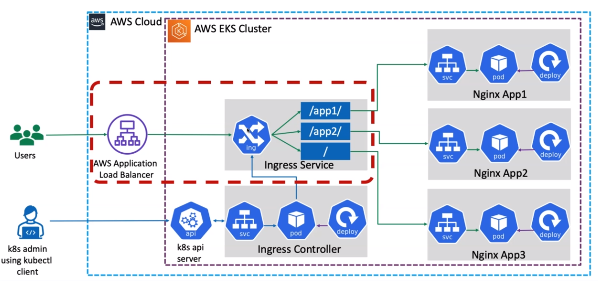

INGRESS CONTROLLER (AWS
---

> Anything within the red triangle is single object in kubernetes which is `ingress`.

 

For us to manage the ingress in AWS, we need to configure the `AWS Load Balancer Controller/Ingress Controller`.

 - [How AWS Ingress Controller Works](./1-how-it-works.md)
 - [Configure AWS Ingress Controller](./2-deploy-aws-alb-ingress-controller.md)

