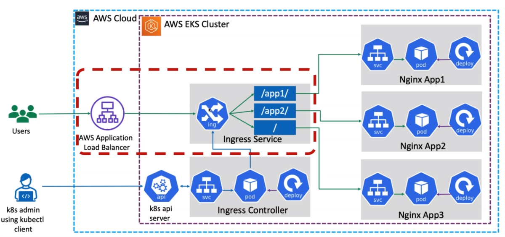
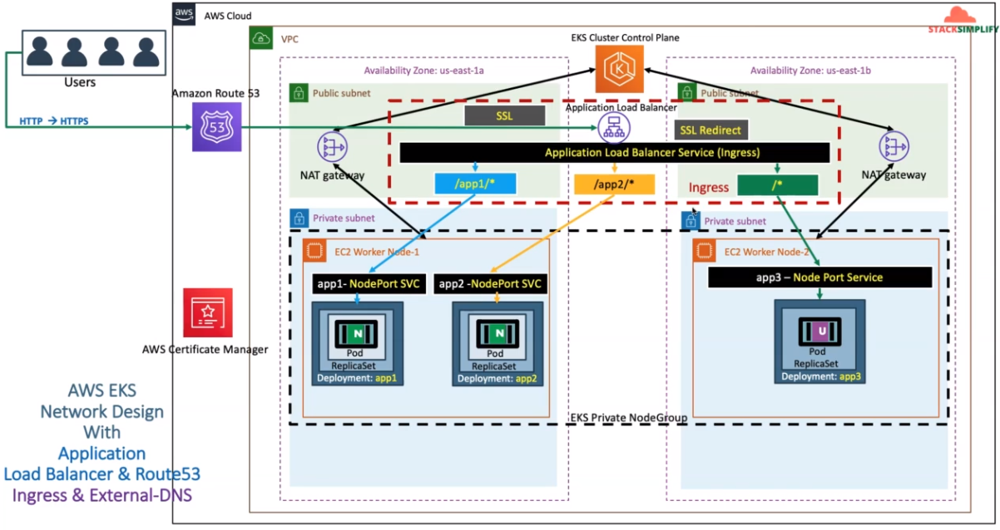

Ingress
---

### High-Level Diagram

#### Routes
 - `/app1/*` - will route to nginx-app1
 - `/app2/*` - will route to nginx-app2
 - `/*` - will route to nginx-app3

Respective annotation alb.ingress.`kubernetes.io/healthcheck-path:` will be moved to respective application `NodePort Service`.

### SSL High-Level Network Diagram

To enable this, please follow [3-external-dns-controller](../../3-external-dns-controller.md) & [4-external-dns.md](./../../4-external-dns.md).

##### References
 - [Ingress Annotations](https://kubernetes-sigs.github.io/aws-load-balancer-controller/latest/guide/ingress/annotations/)